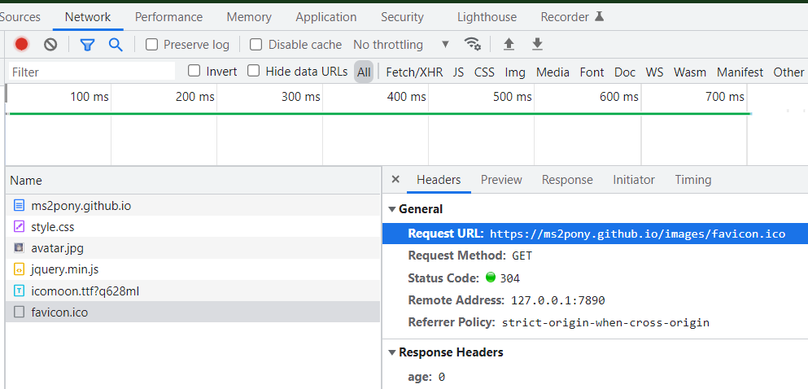

## 2022-1-27 22:36:05
一些关键点：git action, 
一些问题：favicon无法更新、github workflow报错、git的track问题
一些更改：加入并使用concise主题
一些意外收获：favicon

### 一些关键点

- github action：hexo使用github部署github page服务，使用了两个已有的github action：github-pages-deploy-action和checkout，**部分**yaml代码如下：

```yml
# .github\workflows\node.js.yml
# 使用已有github action：github-pages-deploy-action来自动部署github page
- name: Deploy
        uses: JamesIves/github-pages-deploy-action@releases/v3
        with:
          ACCESS_TOKEN: ${{ secrets.ACCESS_TOKEN }} #需要预先配置仓库的secrets中的ACCESS_TOKEN变量
          BRANCH: gh-pages
          FOLDER: public
```

### 一些更改
- 加入并使用concise主题：[仓库地址](https://github.com/sanonz/hexo-theme-concise)，修改了一些配置：将作者名改为自己的名字等，为了将修改后的concise主题同步到自己的github，删除了concise主题仓库的.git文件夹，即将该仓库变为一个普通文件夹。

### 一些问题

1. favicon无法更新：解决方法：打开chrome开发工具，然后刷新，favicon.ico即可更新；

### 一些意外收获
1. favicon：一般为favicon.ico文件，显示如图：


chrome开发工具中的favicon.ico：

